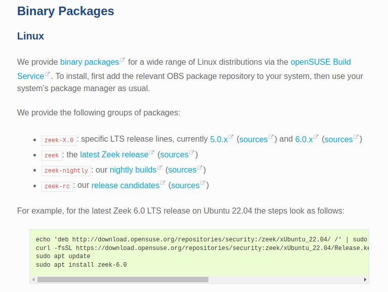
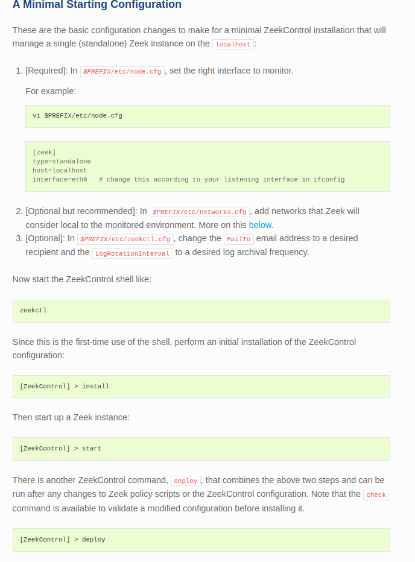

# Zeek/Bro IDS

This project focuses on configuring Zeek as an IDS and writing scripts in the Zeek programming language.

## Table of Contents

- [Introduction](#introduction)
- [Features](#features)
- [Getting Started](#getting-started)
  - [Prerequisites](#prerequisites)
  - [Installation](#installation)
- [Usage](#usage)
- [Contributing](#contributing)
- [License](#license)
- [Acknowledgements](#acknowledgements)

## Introduction

This project centers around configuring Zeek as an Intrusion Detection System (IDS) and developing scripts using the Zeek programming language to enhance its functionality. Zeek, formerly known as Bro, is a powerful network analysis framework that captures network packets and provides a high-level programming language for analyzing them in real-time.

In this project, we'll delve into the setup and configuration of Zeek to function as an effective IDS. Additionally, we'll explore writing scripts in Zeek's scripting language to perform various tasks such as traffic analysis, protocol detection, and threat detection. By leveraging Zeek's capabilities, we aim to enhance network security monitoring and threat detection within our environment.

## Features

Here are the main features of this project:
- Setting up a virtualized environment using VMware Workstation Pro 17.
- Configuring Zeek as an Intrusion Detection System (IDS) within the virtualized environment.
- Writing scripts in Zeek's programming language to enhance network monitoring and threat detection capabilities.

## Getting Started

To get started with this project, follow these steps:

### Prerequisites

Make sure you have the following software or dependencies installed:
- VMware Workstation Pro 17

### Installation

Here is an overview of the lab network:

To set up the virtualized environment, follow these steps:

1. [Install VMware Workstation Pro 17](https://www.vmware.com/products/workstation-pro/workstation-pro-evaluation.html) on your system.
2. **Network Segmentation:** Inside VMware Workstation Pro, configure the Virtual Network Editor as follows:

    
    
    
    Then configure the network segments:
    - **VMnet0:** It is recommended to set the Bridged to drop-down to a specific network card.
    - **VMnet1:** Verify the Host-only radio button is selected. Uncheck the Use local DHCP service checkbox.
    - **VMnet2:** Verify the Host-only radio button is selected. Uncheck the Connect a host virtual adapter and Use local DHCP service checkbox.
    - **VMnet3:** Verify the Host-only radio button is selected. Uncheck the Connect a host virtual adapter and Use local DHCP service checkbox.
    
    It is essential to disable the VMware DHCP service for VMnet1, VMnet2, and VMnet3 and disable the host virtual adapter for VMnet2 and VMnet3. Click Apply, then OK to close the Virtual Network Editor.

3. [Install pfSense ISO](https://www.pfsense.org/download) as a virtual machine. Create the virtual machine with the following requirements:

    
    

4. **Configure the Network Segmentations:** Boot up the pfSense machine and enter the assign Interfaces Wizard. This wizard is used to map our virtual machine's network interfaces (Adapter 1, Adapter 2, and Adapter 3) to their pfSense aliases – WAN, LAN, or OPT1.
    
    

    Assign IP addresses to the WAN, LAN, and OPT1 interfaces using the Set interface(s) IP address wizard.

    
    

5. [Install Kali ISO](https://www.kali.org/) as an attacker and [Install Ubuntu Server ISO](https://ubuntu.com/download/server) as the target victim.

6. [Install Zeek IDS](https://docs.zeek.org/en/master/get-started.html) on the Ubuntu Server ISO:
    
    
    
    Perform the initial configuration for Zeek:

    

7. [Follow the instructions of this link](https://blog.atyafnet.com/setup-remote-span-with-openvpn-tap/) to replicate the TAP function using OpenVPN.

## License

This project is licensed under the [MIT License](https://opensource.org/licenses/MIT).

## Acknowledgements

We would like to acknowledge the following individuals and organizations for their contributions, support, and inspiration:
- [Zeek Network Security Monitor](https://www.zeek.org/) - For providing the powerful network analysis framework that forms the foundation of this project.
- Instructor Bùi Trọng Tùng - For valuable insights and guidance during the development process.
- The open-source community - For creating and maintaining the tools and libraries used in this project.
