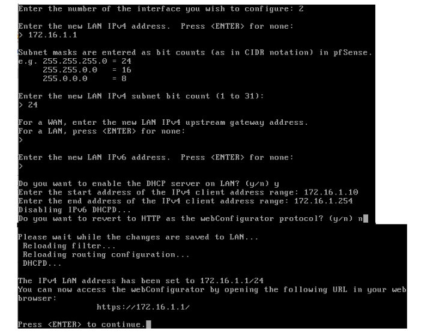

# Zeek/Bro IDS

This project will focus on configuring zeek as an ids and write some script in zeek programming language

## Table of Contents

- [Introduction](#introduction)
- [Features](#features)
- [Getting Started](#getting-started)
  - [Prerequisites](#prerequisites)
  - [Installation](#installation)
- [Usage](#usage)
- [Contributing](#contributing)
- [License](#license)
- [Acknowledgements](#acknowledgements)

## Introduction

Introduction
This project centers around configuring Zeek as an Intrusion Detection System (IDS) and developing scripts using the Zeek programming language to enhance its functionality. Zeek, formerly known as Bro, is a powerful network analysis framework that captures network packets and provides a high-level programming language for analyzing them in real-time.

In this project, we'll delve into the setup and configuration of Zeek to function as an effective IDS. Additionally, we'll explore writing scripts in Zeek's scripting language to perform various tasks such as traffic analysis, protocol detection, and threat detection. By leveraging Zeek's capabilities, we aim to enhance network security monitoring and threat detection within our environment.

## Features

Here are the main features of this project:
- Setting up a virtualized environment using VMware Workstation Pro 17.
- Configuring Zeek as an Intrusion Detection System (IDS) within the virtualized environment.
- Writing scripts in Zeek's programming language to enhance network monitoring and threat detection capabilities.

## Getting Started

To get started with this project, follow these steps:

### Prerequisites

List any software or dependencies required to run your project. For example:
- VMware Workstation Pro 17

### Installation
Here is the overview of the lab : 
\

1. [Install VMware Workstation Pro 17](https://www.vmware.com/products/workstation-pro/workstation-pro-evaluation.html) on your system.
2. Network Segmentation : 
Inside VMware Workstation Pro, config Virtual Network Editor :

By default, VMware Workstation ships with three virtual network segments defined – VMnet0 ,
VMnet1 , and VMnet8 . VMnet0 serves as the bridged network segment, VMnet1 acts as a host-only
network, and VMnet8 is a NAT network segment. We'll need to create two more virtual
network segments, and make some configuration changes while we're here.\

\
 \

Then configure the network segment :
VMnet0 : It is recommended to set the Bridged to drop-down to a specific network card.
VMnet1 : Verify the Host-only radio button is selected. Uncheck the Use local DHCP service checkbox
VMnet2 : Verify the Host-only radio button is selected. Uncheck the Connect a host virtual adapter, and Use local
DHCP service checkbox
VMnet3 : Verify the Host-only radio button is selected. Uncheck the Connect a host virtual adapter, and Use local
DHCP service checkbox
It is extremely important that the VMware DHCP service is disabled for VMnet1 , 2 and 3 and that the host virtual
adapter is disabled for VMnet2 and 3 . Once finished Click Apply, then OK to close the Virtual Network Editor.

2. [Install pfsense ISO ](https://www.pfsense.org/download) as a virtual machine\
Create the virtual machine with the following requirements :
 \
 \

3. Configure the network segmentations 
First, boot up the pfSense machine and enter the assign Interfaces Wizard .This wizard is use to map our virtual machine's
network interfaces (Adapter 1, Adapter 2, and Adapter 3) to their pfSense aliases – WAN, LAN, or OPT1.\
 \
The next task we will need to perform on the pfSense command-line is assigning IP addresses to
the WAN, LAN, and OPT1 interfaces using the Set interface(s) IP address wizard.

 \
 \

## Usage

Provide examples or instructions on how to use your project. Include code snippets or screenshots if necessary.

## Contributing

Explain how others can contribute to your project. Include guidelines for pull requests, code style, and any other relevant information.

## License

Specify the license under which your project is distributed. For example, MIT License, Apache License 2.0, etc.

## Acknowledgements

Give credit to any individuals, organizations, or resources that have helped or inspired your project.

